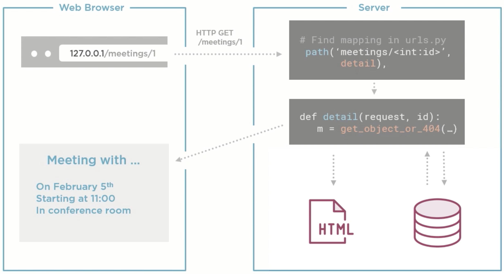
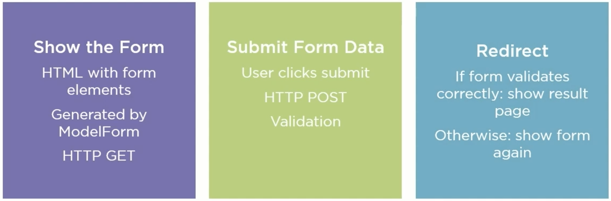

# Django tutorial project - Meeting Planner


## Django project structure


A Django project is a big python package, which typically contains models, views, templates, and urls among others. A 
Django project also contains several `apps`, each of them itself is another child package of the main Django project 
package. It is a convention in the Django project to distribute the functionalities of the web application in to these 
smaller `apps`. In more advanced use cases, these `apps` can be reused by multiple Django projects, which is out of 
scope for this beginner project. Each of these `apps` should be small, easily defined unit of work, contributing to the 
main web application.

## Useful Commands


* `django-admin startproject meeting_planner` - To start a django project called meeting_planner.
* `python meeting_planner/manage.py runserver` - To start the django web server for the meeting_planner project in its 
initial form.

> Django by default runs the server in the debug mode i.e., in the `meeting_planner/meeting_planner/settings.py`,
> `DEBUG = True`. This is not advisable, when the app is deployed in the production.

> The `meeting_planner/meeting_planner/settings.py` file in this project encapsulates all the server settings for the 
> meeting_planner web application. For example, we change the `LANGUAGE_CODE` or `TIME_ZONE` used in the project.

## Files created by the startproject command and their purposes:


* `meeting_planner/manage.py` - Entry point for the project, which dispatches the commands like _runserver_ and 
_manage_ etc.
* `meeting_planner/db.sqlite3` - Created upon running the server to store the data models as relational tables.
* `meeting_planner/meeting_planner/asgi.py` - Needed for project deployment to production.
* `meeting_planner/meeting_planner/wsgi.py` - Needed for project deployment to production.
* `meeting_planner/meeting_planner/settings.py` - Customizes the project as per our needs.
* `meeting_planner/meeting_planner/urls.py` - Registers routes to the webserver.

## Phase I


In the first phase, we add a simple page to the web application, by registering route and providing the respective 
handler function as a view.

* Create a Django app.
  * `python manage.py startapp website` - Creates an app called `website` inside the `meeting_planner` directory. It is
    a convention in Django to manage the parent web application in smaller set of units called **apps**. An app is 
    basically a Python package. This is supposed to create a file structure with the root directory name as `website` 
    inside the parent `meeting_planner` directory. For now, we'd remove everything, what were created leaving only 
    `__init__.py` and `views.py`. We'd do so to understand, what an **app** is, and how it fits inside a Django web 
    application.
  * Add the `website` in the list `INSTALLED_APPS` inside the `meeting_planner/meeting_planner/settings.py`, because 
    meeting_planner is the main Django web application, which we are building.
* Add a view function.
  * We go to the website app, and create a **view** inside the views.py. A view in Django handles the request to a web 
  page. In order to make simple page come into existence, we perform the following steps.
  * Add a handler function e.g., `welcome(request: HttpRequest) -> HttpResponse` to the `website/views.py`.
* Register an url against the view function.
  * Register a path in the `meeting_planner/urls.py` in the `urlpatterns` list as `path('welcome.html', welcome)`, 
  which adds a path string _welcome.html_ and registers `welcome` function as the respective handler of the 
  request received in this path. And then upon running the server, the path is served.
  * We also can register the handler function for the homepage in the same way, where we'd register the path to be 
  something like `path('', home)`.
* Run server and view the page.

## Phase II


In the second phase, we deal with capability of Django to implement the object relational mapping as well as database 
migration. We don't go deep into the concept of migration, and limit our scope of this project to the initial migration 
to set up the database.

Model is the Python class, which gets translated to a relational table, and objects get translated as the rows of the 
respective table. Once class object can have reference of the other class object. Hence, Django has utilities for 
maintaining those as foreign key relationships. However, in this project we won't go too deep into that.

Migration comes into play, when some of our table schemas change. From the relation database point of view, this is a 
DDL change. This may happen, when we add / remove / modify one or more attributes of the Python object. Then we have 
to make the respective changes in the columns of the respective table. These changes are handled by migration. When 
such a change becomes necessary, a migration script is generated by Django to enforce the required change in the 
database. However, when we deal with very complex relational schemas, Django often can not handle those migration 
situations by itself, and in those cases we need to provide custom migration strategies. In this project we won't deal 
with such situations.

As a starting point, we see in the `meeting_planner/meeting_planner/settngs.py` the following installed apps.

```python
INSTALLED_APPS = [
    'django.contrib.admin',
    'django.contrib.auth',
    'django.contrib.contenttypes',
    'django.contrib.sessions',
    'django.contrib.messages',
    'django.contrib.staticfiles',
    'website',
]
```
These are some names, which pop up, when we run the server using `python meeting_planner/manage.py runserver` command 
as well.

```text
You have 18 unapplied migration(s). Your project may not work properly until you apply the migrations for app(s): admin, 
auth, contenttypes, sessions. Run 'python manage.py migrate' to apply them.
```

Each migration is a Python script, which makes some changes in respective database models. We can see the details of the 
migrations using the command `python  meeting_planner/manage.py showmigrations` and this initially creates the following 
list.

```text
admin
 [ ] 0001_initial
 [ ] 0002_logentry_remove_auto_add
 [ ] 0003_logentry_add_action_flag_choices
auth
 [ ] 0001_initial
 [ ] 0002_alter_permission_name_max_length
 [ ] 0003_alter_user_email_max_length
 [ ] 0004_alter_user_username_opts
 [ ] 0005_alter_user_last_login_null
 [ ] 0006_require_contenttypes_0002
 [ ] 0007_alter_validators_add_error_messages
 [ ] 0008_alter_user_username_max_length
 [ ] 0009_alter_user_last_name_max_length
 [ ] 0010_alter_group_name_max_length
 [ ] 0011_update_proxy_permissions
 [ ] 0012_alter_user_first_name_max_length
contenttypes
 [ ] 0001_initial
 [ ] 0002_remove_content_type_name
sessions
 [ ] 0001_initial
```

Each of the lines shown in this list is a migration. They are automatically generated and perform some steps to alter 
DDL schemas in the database.

We can perform these migrations using the command `python meeting_planner/manage.py migrate` and this command performs 
the migrations.

```text
Operations to perform:
  Apply all migrations: admin, auth, contenttypes, sessions
Running migrations:
  Applying contenttypes.0001_initial... OK
  Applying auth.0001_initial... OK
  Applying admin.0001_initial... OK
  Applying admin.0002_logentry_remove_auto_add... OK
  Applying admin.0003_logentry_add_action_flag_choices... OK
  Applying contenttypes.0002_remove_content_type_name... OK
  Applying auth.0002_alter_permission_name_max_length... OK
  Applying auth.0003_alter_user_email_max_length... OK
  Applying auth.0004_alter_user_username_opts... OK
  Applying auth.0005_alter_user_last_login_null... OK
  Applying auth.0006_require_contenttypes_0002... OK
  Applying auth.0007_alter_validators_add_error_messages... OK
  Applying auth.0008_alter_user_username_max_length... OK
  Applying auth.0009_alter_user_last_name_max_length... OK
  Applying auth.0010_alter_group_name_max_length... OK
  Applying auth.0011_update_proxy_permissions... OK
  Applying auth.0012_alter_user_first_name_max_length... OK
  Applying sessions.0001_initial... OK
```

After applying the migrations, we can check if the database appears to be in correct state using the command 
`python meeting_planner/manage.py dbshell`. There could be alternative ways as well as using the DB Browser for SQLIte 
etc. In the shell, we can use simple tricks and queries like this.

```text
sqlite> .tables # To show all tables
auth_group                  auth_user_user_permissions
auth_group_permissions      django_admin_log          
auth_permission             django_content_type       
auth_user                   django_migrations         
auth_user_groups            django_session

sqlite> select * from django_migrations; # This is an important table storing all migrations
1|contenttypes|0001_initial|2021-11-30 06:30:08.400864
2|auth|0001_initial|2021-11-30 06:30:08.425836
3|admin|0001_initial|2021-11-30 06:30:08.435712
4|admin|0002_logentry_remove_auto_add|2021-11-30 06:30:08.452346
.
.
etc

sqlite> .exit 0 # Exits from the sqlite console with a return code of success
```

* Create Django model.
  * Create a new `meetings` app using the command `python manage.py startapp meetings` and also register the meetings' 
    app to the `INSTALLED_APPS` list in the `meeting_planner/settings.py`. Creating the app also creates several files, 
    as we have seen before. Among them following are the ones, which we'd make use of for now.
    * admin.py - Configure the Django admin interface
    * models.py - Create the model class for the meeting
    * views.py - Create the view for the model class
  * We create a class Meeting extending from the `django.db.models.Model`, where we put the fields as the attribute of 
    the class itself. Django looks at the class attributes of the model class, and creates `__init__` method itself. 
* Create and run database migration.
  * We create a migration of the Meeting model with the command `python manage.py makemigrations` and this creates the 
    following migration script in migrations directory of the meetings' app.
    ```text
    Migrations for 'meetings':
    meetings/migrations/0001_initial.py
      - Create model Meeting
    ```
    A migration with the name 0001_initial has been created. The type `django.db.migrations.Migration` is independent of 
    the underlying database being used. That means, depending on the database being used, each time the SQL script, that 
    it would result in, could be different. In this case we can inspect the sqlite CREATE TABLE query with using the 
    command `python manage.py sqlmigrate meetings 0001`. We don't need to mention the full name of the migration and 
    this would output the following sql query.
    ```text
    BEGIN;
    --
    -- Create model Meeting
    --
    CREATE TABLE "meetings_meeting" ("id" integer NOT NULL PRIMARY KEY AUTOINCREMENT, "title" varchar(200) NOT NULL, 
    "date" date NOT NULL);
    COMMIT;
    ```
    And now like before, we can run the new migration with the command `python manage.py migrate` and this would create 
    a table called, `meetings_meeting`. The table name is generated by prepending the app name to the model. We can 
    inspect the same using the sqlite console like before, using the command `python manage.py dbshell`.
* Edit data with Django admin interface
  One use of the admin interface is to create entries for the model classes. For doing that we need to register the 
  model with the admin site, and configure a superuser.
  * To register our model with the admin interface, we need to go to `meeting_planner/meetings/admin.py` and register 
    our model using the `django.contrib.admin.register` function. The url path for admin interface is already configured 
    in the `meeting_planner/meeting_planner/urls.py`, which acts slightly differently than all other paths.
  * Before accessing the admin page, we need to create a superuser with the command, `python manage.py createsuperuser`, 
    which prompts for credentials and provides a basic password strength validation as well.
  * Upon creating the superuser, we can access the admin site by running the server again and authenticate. Upon 
    logging in, we can see two predefined tables, `Groups`, and `Users`, which are used by admins to manage access to 
    the web application. For now, we'd simply locate the `Meeting` table and make few entries. We'd also appreciate the 
    fact, that Django creates customized html forms for us to interact with the tables. Upon doing this, we can also 
    validate the data entry to the table using the `dbshell` utility or DB Browser.

Now, that we understand a bit about the migrations, and how they work, we can create convenient easy to follow workflow 
for the simpler use cases.
```text
# Step 0: Make sure, that we have registered the app in the INSTALLED_APPS list of the main web app.
# Step 1: Change the model code in the specific registered app.
# Step 2: Generate migration script using: python manage.py makemigrations and review it.
# Step 3: Check the lost of the migrations to be executed using: python manage.py showmigrations and review it.
# Step 4: Run the migrations using: python manage.py migrate and review it via SQL utilities.
```

Now we look into a bit advanced scenario, which is yet again the simpler version of the situations, that we might 
encounter during the day-to-day activities with a Django project. In this scenario, we are going to create another 
model, add a foreign key, which stands as the relational database equivalent of an object having reference of another 
object.

* We add two new fields, `start_time: TimeField`, and `duration: IntegerField` in the `Meeting` model class.
* At this point, we could try to create a new migration, since this is a DDL schema change, however there is an issue. 
  When we execute `python manage.py makemigrations`, there should be a warning, which goes like this.
  ```text
  You are trying to add a non-nullable field 'duration' to meeting without a default; we can't do that (the database 
  needs something to populate existing rows).
  ```
  This tells us, that the IntegerField is not nullable, when the migration would be created, what happens for the 
  existing rows of the table !. In order to fix this we further need to modify the new fields and a default value, where 
  needed.
* After adding the default strategies, we can again try `python manage.py makemigrations` and this time it should 
  succeed with creating new migration e.g., `meetings/migrations/0002_auto_20211130_0914.py`. We can naturally check 
  the same file and also check the resulting sql with `python manage.py sqlmigrate meetings 0002`, and this time the 
  sql would be a bit more complex.
  ```text
  BEGIN;
  --
  -- Add field duration to meeting
  --
  CREATE TABLE "new__meetings_meeting" ("id" integer NOT NULL PRIMARY KEY AUTOINCREMENT, "duration" integer NOT NULL, 
  "title" varchar(200) NOT NULL, "date" date NOT NULL);
  INSERT INTO "new__meetings_meeting" ("id", "title", "date", "duration") SELECT "id", "title", "date", 1 FROM 
  "meetings_meeting";
  DROP TABLE "meetings_meeting";
  ALTER TABLE "new__meetings_meeting" RENAME TO "meetings_meeting";
  --
  -- Add field start_time to meeting
  --
  CREATE TABLE "new__meetings_meeting" ("id" integer NOT NULL PRIMARY KEY AUTOINCREMENT, "title" varchar(200) NOT NULL, 
  "date" date NOT NULL, "duration" integer NOT NULL, "start_time" time NOT NULL);
  INSERT INTO "new__meetings_meeting" ("id", "title", "date", "duration", "start_time") SELECT "id", "title", "date", 
  "duration", '09:00:00' FROM "meetings_meeting";
  DROP TABLE "meetings_meeting";
  ALTER TABLE "new__meetings_meeting" RENAME TO "meetings_meeting";
  COMMIT;
  ```
  We see, that for each of the new columns, it is creating a new table, inserting data from the old, dropping the old 
  table, and finally renaming the new table to the old table name.
* We migrate to the new schema using `python manage.py migrate`.
* Before logging in to the admin interface and interacting with the table again, it would be a good idea to add a 
  string representation of our model in the class, because this would result in a better viewing of the object in the 
  UI. This does not need a separate migration, because this is not a DDL schema change.
* Now we create a separate new model called `Room` in the same meetings' app. After creating this new model, we can 
  use `python manage.py makemigrations` command to create the migration. However, we have to add another constraint 
  before we actually go ahead and migrate. A meeting takes place at a certain room. Hence, `Meeting` object should have 
  a reference of a given `Room` object. This translates into relational table as a column for room in the meeting table 
  as a foreign key constraint for room table. A certain meeting id from the meeting table is a foreign key in the room 
  table. While adding the foreign key constraint, we'd use the deletion strategy as cascade. That means, when a room 
  is deleted, all meetings scheduled in that room are also deleted.
  > At this point, when we'd try to create a migration for our changes, we're likely to face a very similar problem as 
  > before, for the existing data in the meetings table. It would ask us, what happens for the room entry of the pre-
  > existing meetings. This time instead of fixing with a default value, we'd rather do something drastic. We'd delete 
  > all the predefined migrations as well as the default database file, `db.sqlite3`. And then we create our migrations 
  > from a clean slate.
* Now upon cleaning up, and running `makemigrations` again, we'd see a new migrations handling the database schemas from 
  the scratch. A new database, `db.sqlite3` files would also be created. But this has some implications as well, which 
  makes it a questionable approach for an already existing complex project. Upon deleting the database, we lost our 
  previous table schemas, and the superuser as well. Our next step therefore is, <strong> register Room class to be 
  used with the admin site </strong>, make all migrations, and create a superuser before accessing the admin interface. 
  We can see all migrations at this point using `python manage.py showmigrations` command before actually making them. 
* We now make the migrations, and create superuser using the `python manage.py migrate`, and `python manage.py create
  superuser` commands before running the server.
* Now upon accessing the admin interface, we can create meeting, and appreciate Django proving us with the convenient 
  UI option to add a room on the fly.

## Phase III


Model-Template-View pattern for web applications are synonymous to MVC pattern. Three components mode, template and 
views, each has fixed responsibility. In this phase, we add templates to our application, subsequently we make all of 
our components to work together. We call models and templates from view. We add view parameters in url, and we also 
deal with HTTP 404 not found error, when necessary. 

> Templates are the skeleton of an HTML page. We generate displayable HTML content from templates.

> Views are the components, that actually displays the data in the browser. Hence, they make use of the templates. In 
  order to display the data in browser view make use of the models and pass the data from the models to the templates.

Following are the tasks, which we accomplish in this phase.

* Introduce the templates.
  * We created a template inside the `website` app in the specific location `website/templates/website/welcome.html`. The 
    reason for putting the actual html template inside another website directory inside the **templates** directory is, 
    to further modularize the app templates. The reason for doing this is, two or more apps can share common templates. 
    In this case, we designated, that __welcome.html__ template would be used by the website app only. This is not a 
    requirement for Django, rather for better organizing our projects. However, putting the templates for an app inside 
    the **templates** directory is the default option in Django. This is customizable via `settings.py` file of the Django 
    project. This is an advanced concept, and we won't try to do it for now.
  * We could use [Jinja](https://jinja.palletsprojects.com/en/3.0.x/) syntax inside our template to implement dynamic 
    webpage. In this example, we have used several variables to supply some basic data dynamically to the template from 
    the view function.
* Complete the model-view-template pattern.
  * We make minor change in the template __welcome.html__, and include variable in the template context. This variable 
    should show the number of the total number of meetings in the database at any given moment. We include the value 
    of this variable ot the template context from views using `Meeting.objects.count()` call. This may change in the 
    future, as we refactor.
  * Now we need to implement a meeting detail page. For that we take three distinct but relatable steps.
    * We include a new templates, having the similar semantics as before at `meetings/templates/meetings/detail.html`. 
      In this template html, we access various the fields of the `Meeting` model and display.
    * We create a view function `detail` in the **meetings** app, `meetings/views.py`. This function takes an additional 
      keyword argument called, `meeting_id`, which would be used to select a particular meeting from all the meetings.
    * Finally, we create the url mapping for the meeting details page in the `meeting_planner/urls.py`, and this time 
      we use special syntax for the path, `meetings/<int:meeting_id>`. This is, how we register a path parameter in 
      Django. It tells, that the call to meeting detail page has to be made like this, 
      `http://<host>:<port>/meetings/<integer id>` e.g., http://localhost:8000/meetings/1. But we also have to think 
      about implementing the error handling for a non-existing meeting id.
    * In order to retrieve a Meeting model object, earlier were calling `Meeting.objects.get(pk=meeting_id)`, which 
      results in an exception, when a model is not found. There is a bit more elegant way to handle, that situation, 
      called `get_object_or_404` in Django, which is a utility function, that returns the desired object, when found 
      or raises `Http404` exception otherwise. We now retrieve the meeting object like this instead, `get_object_or_404
      (klass=Meeting, pk=meeting_id)`, and that the 404 resource not found page for us, when we provide some 
      non-existing, invalid value, or nothing as the path parameter.


<center> Image source: <a href="https://app.pluralsight.com/library/courses/django-getting-started/table-of-contents" 
target="_blank">django-getting-started</a> </center>

At the end this phase, we can summarize, that the `Model` represents data, and is responsible for the object relational 
mapping. `Template` represents the presentation of the data into dynamic webpages. `View` maintains the behavior for a 
certain url pattern and works with models and templates. As we mentioned already, this same MTV patterns is known as 
MVC pattern outside Python web application ecosystem of packages. Following are some example functions, which we have 
used in this phase so far.
  * [Model.objects.all](https://docs.djangoproject.com/en/3.2/topics/db/queries/#retrieving-all-objects) 
  = Returns a list of all objects
  * [Model.objects.count](https://docs.djangoproject.com/en/3.2/ref/models/querysets/#count) 
  = Returns the count of all objects
  * [Model.objects.get](https://docs.djangoproject.com/en/3.2/topics/db/queries/#retrieving-a-single-object-with-get) 
  = Gets a specific object by id

## Phase IV

In this phase, we are going to work with URLs and link building. Before, that we would like to have revision of our 
Django project structure. For complex web applications, Django project structure can become very confusing, and it 
is important to understand, what is where. Following is our simple project structure, inside the `djangotutorial` 
workspace.

* `meeting_planner` is the Django project, which we have created using the `django-amin startproject` command. At this 
  level we see the `manage.py` file, which acts as the central command line management entrypoint, because after creating 
  this Django project, we have dispatched all commands in context of manage.py. At the same level we also see the 
  `db.sqlite3` file, which functions as the central database.
* `meeting_planner/meeting_planner` is the main Django app (inside the meeting_planner Django project). This is, where 
  the `settings.py`, and `urls.py` files reside.
* `meeting_planner/meetings` is the app, where we consolidate our models, for which we have two, `Meeting`, and `Room`. 
  It also therefore, defines the views and templates to control, how the model data would be displayed.
* `meeting_planner/website` is the app, where we only define the templates and views, which are somewhat specific to the 
  website / homepage itself, and has in general nothing to do with any specific model so far.

In this phase, we'd implement a utility, so that we can navigate to a certain meeting from the homepage itself. That 
means, we need to build links to each meeting details, and include them in the homepage. In order to do that, we'd now 
learn the link building.

* Iterate inside the template.
  * Firstly, we can use combination of [Jinja Templates](https://jinja.palletsprojects.com/en/3.0.x/templates/) in order 
    to write some rudimentary code inside the templates. For instance, we have made use of {{}} for expressions and 
     for statements in the `meeting_planner/website/templates/website/welcome.html` template. In this case, we are 
    generating some links for our meetings.
* Named URLs
  * While generating the links for the meetings, we need some efficient mechanism, such that, when we need to change some 
    links, it does not break things, or we don't need to make changes in a lot of places. Named url mappings provide us 
    with an easy way to do it. In order to do that, we do mainly two things.
    * In the `meeting_planner/website/templates/website/welcome.html`, instead of building our links inside the `li` tag 
      like this `<a href="meetings/{{ mt.id }}"> {{ mt.title }} </a>`, we do it using a special Django syntax, 
      `<a href=""> {{ mt.title }} </a>`. The advantage is, if we change the url from the central 
      url.py, our links in the webpage adjust themselves accordingly without breaking.
    * In order to make sure, that the above code works, we however have make another small change called named url. We'd 
      refactor the path in the `meeting_planner/meeting_planner/urls.py` like this, 
      `path('meetings/<int:meeting_id>', detail, name='detail')`. With this change, we are giving a name to that the 
      `meetings/<int:meeting_id>` url path. And then we refer to that name from the Django syntax used in the template 
      body. Without this adjustment, there would be an error in the web server called, `NoReverseMatch: Reverse for 
      'detail' not found. 'detail' is not a valid view function or pattern name.`.
    * At this point we have practiced with the details, we learned above and added separate page for showing all the 
      rooms, and a detail page for each room as well. We have also added a navigation block for each page to go back 
      to the home page. However, we need to follow some best practices in order to manage our url mappings. These best 
      practices are the following.
      * Each app has its own urls.py.
        * We have created the `meeting_planner/meetings/urls.py` file, which now has one list called `urlpatterns`, 
          similar to the `meeting_planner/meeting_planner/urls.py`, but this list in the `meetings` app only has the 
          url mappings for its own views. This way a given app manages only its own urls and corresponding views as a 
          single unit.
      * App prefix in main urls.py in the main application, and include app urls in main urls.
        * In order to enable each app, managing its own urls and views, we have to make use of `django.urls.include` 
          function. In the `meeting_planner/meeting_planner/urls.py`, now we include the paths from the `meetings` app 
          using this element in our previous `urlpatterns` list instead,  `path('meetings/', include('meetings.urls'))`. 
          There however one underlying details, we need to understand here about app prefixes, and this has everything to 
          do with, how Django manages the urls with this new organization. The `meeting_planner/meetings/urls.py` has 
          the following mappings, `<int:meeting_id>`, `rooms`, `rooms/<int:room_id>`, and we have included these url 
          mappings in main `urlpatterns` with the prefix `meetings/`. This means, Django would implicitly add this prefix 
          to all of the `meetings` app url mappings during the path resolution e.g., request to show the details of a 
          specific meeting would have url path `meetings/<meeting_id>`, but request to show the details of a specific room 
          would have the url path `meetings/rooms/<room_id>`. Similarly, request to show all rooms would have the url 
          path `meetings/rooms`, and Django would manage all these internally.

## Phase V

In this phase we'd use CSS to add some style to our webpage. We'd also further organize the webpages and apply the 
same style pattern to multiple pages using template inheritance.

* We add custom stylesheet to the webpage as static content. It is an important thing to remember, that the stylesheet 
  goes to a directory, called `static`, and not in the same directory as with the templates. Django has a very specific 
  way to load such static content in the browser. In this exercise, we have created `website/static/website/style.css` 
  inside the `website` package, just like we did for the templates. We have added some styles to the stylesheet to be 
  applied to the body of the webpage. In order to link the stylesheet, we made use of Jinja syntax like this, 
  `<link rel="stylesheet" href="">`, and in order to make it work, we needed to 
  instruct Django specifically towards the top of the html template file with, `` to load all the 
  static resources to browser. Any resource, which we want to load in the browser e.g., an image also qualifies as a 
  static content. We have also added an image to the website page now in the same way. Therefore, `static` is the 
  keyword to use to load all external contents.

* **Template Inheritance** helps to apply same style across the web application. We might have a complex multiple page 
  web application, and we might want to maintain a common theme across all pages. Template inheritance comes handy 
  in such a situation. In order to create an HTML template, we have created `website/templates/base.html`. The template 
  html file is outside the namespace of app, because it would most likely be shared by multiple pages. In this base html 
  file, we have applied the stylesheet. We have also introduced a block statement there, which takes the form of 
  ` `. These blocks mark the content area, which would be replaced by the child 
  html files, which would specialize the base html. With this base html in place, now we are going to make significant 
  changes to the html file, starting with the `meeting_planner/website/templates/website.welcome.html`. Essentially, 
  we would include a Django statement at the top `` and then we would provide the content 
  for the content blocks. 
  > One interesting and beneficial aspect, is that the base templates can be used across the apps. For instance, in this 
  > example, we have created the base template in the `website` app, but we can extend the same base template for the 
  > pages defined in the `meetings` app as well, in the same way. Therefore, `extends` is the keyword a html page to 
  > extend from a base template across the apps. We have to keep in mind, that wherever, we want the contents to be 
  > replaced in child pages, we have to use `block` and `endblock` keywords to create a uniquely named block.

## Phase VI

In this phase we'd work with creating a form in the web page. We'd make use of a Django utility called `ModelForm` and 
implements appropriate handlers for submit action.

* Create template with `ModelForm`.
  * We created a view function `new_meeting` in the `meetings/views.py` file of the `meetings` app. This time we need to 
    do quite a few things correctly in order to make use if Django `ModelForms`. Django offers a function for creating 
    the simple forms, called `django.forms.modelform_factory`, which takes the models class, and specification, if any 
    of the fields should be excluded from the form. This is again the base usage of the model form utility. This function 
    returns a `Type[BaseModelForm]`, which we instantiate, and include in the template context.
  * We then create a template file, in this case `meetings/templates/meetings/new.html`, which has some new constructs 
    this time. Among other things, we have a `form` tag, and inside there is a `table` tag. For now, inside the table 
    tag we place the form with a variable `{{ form }}` Jinja statement. Thereafter, we need to keep three important 
    additional things in mind.
    * We need to add the `method="post"` attribute to the form. By default, all elements use GET method, but we want the 
      form to be sent to web server with POST method to comply with the convention.
    * We need to include another statement inside the `form` tag with the `` with Jinja syntax. This 
      is a utility, which validates against the [Cross Site Request Forgery](https://en.wikipedia.org/wiki/Cross-site_request_forgery)
      attack upon the form submission. All forms used with a Django web application must include this, otherwise the 
      form will not work.
    * Last but not the least, we need to add a submit button `<button type="submit">Schedule</button>` in the `form` 
      tag, which BaseModelForm does not generate by itself.
  * Finally, in order for the view function to be served, we'd add the path specification to the url patterns inside the 
    meeting app, `meetings/urls.py`.


<center> Image source: <a href="https://app.pluralsight.com/library/courses/django-getting-started/table-of-contents" 
target="_blank">django-getting-started</a> </center>

* Processing the user input.
  * Add control flow inside the `new_meeting` view function. Usually the control flow here is straight forward. We are 
    first checking is the form is valid with the `is_valid` method. This has many advantages. Django has implemented 
    utilities to show error hints to the browser, and this method enables them out of the box. And then construct 
    another BaseModelForm object, if the data is valid. And on that BaseModelForm object we simply call the `save` 
    method to persist the form data as a new `Meeting` to the database. The form validation implemented by Django 
    provides an efficient safety mechanism against several vulnerabilities. While browsers can provide some validation 
    options, we should not rely on them solely.
  * If the submission is successful, we make use of another utility method `django.shortcust.redirect`, which takes 
    the name of a view function across the apps (in this case we provide the home view function, which is defined in 
    the meeting_planner app), retrieves the corresponding url and redirects to it. In this case we get batch to the 
    home page, where all of our meetings are listed.
  * Finally, there are some ways to improve the behavior of our form. For that, we would specialize the `ModelForm` 
    class, and implement our own ModelForm. We have done that in the `meeting_planner/meetings/forms.py`. Now we are 
    no longer using `BaseModelForm` class in the `meeting_planner/meetings/views.py` file. Using our own ModelForm 
    helped us to get advanced form properties in the browser, especially with the date field, which we particularly 
    tried to handle in our ModelForm class.


